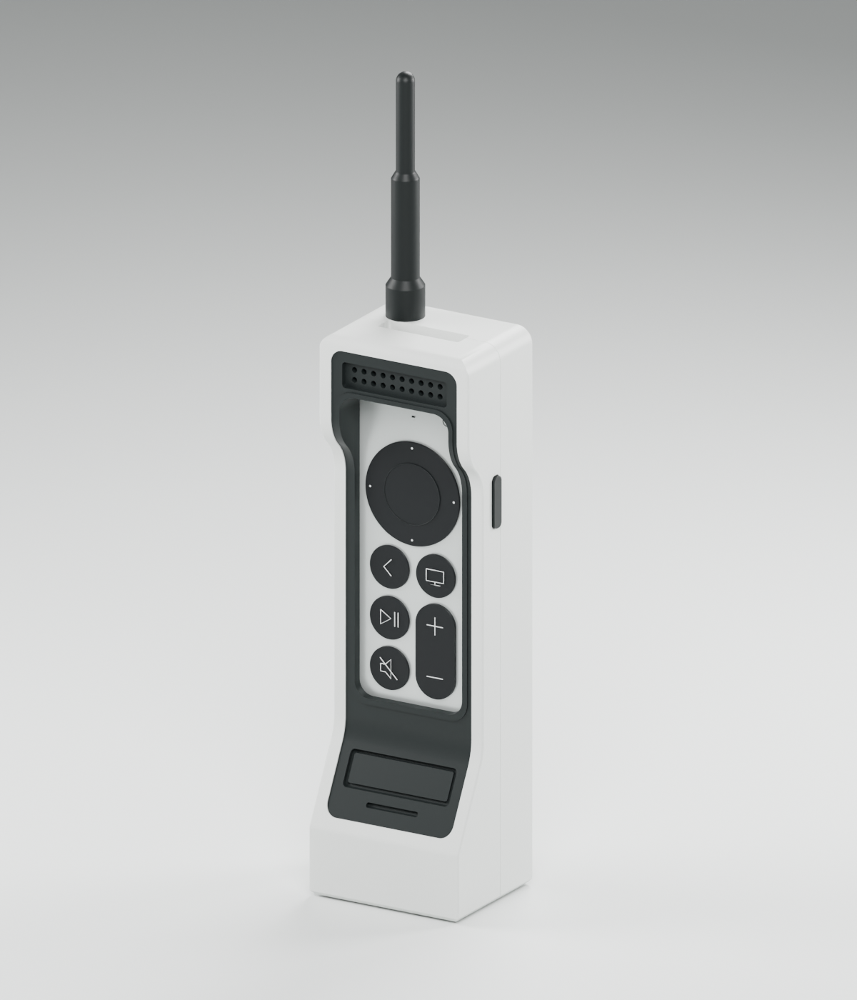
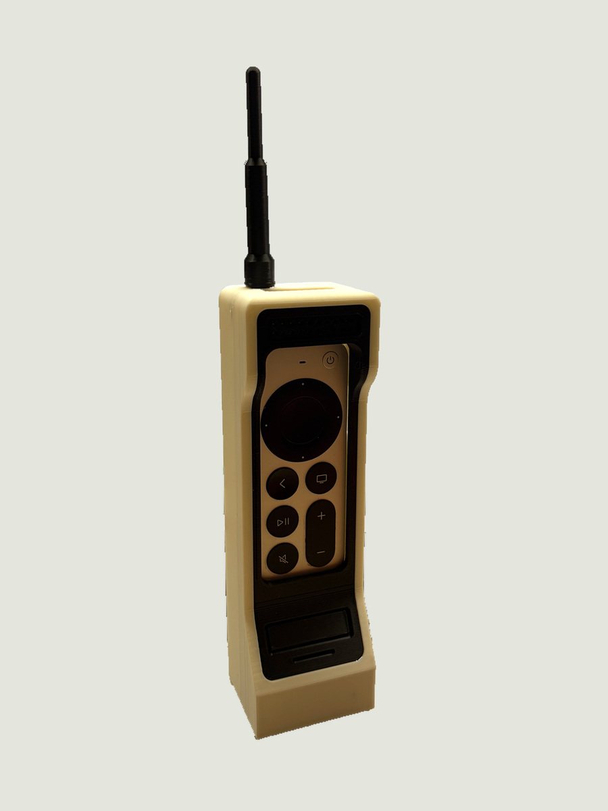
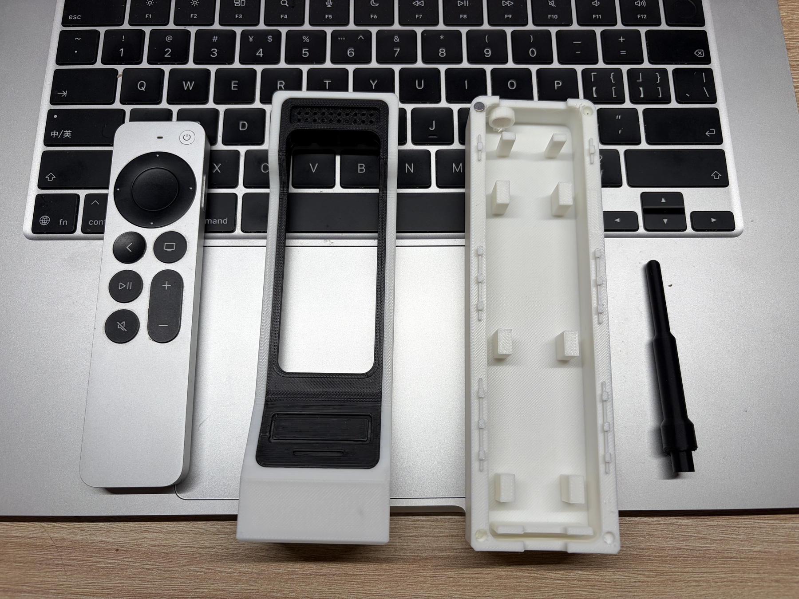

# Apple TV 大哥大遥控器外壳

适配 Lightning 版 Siri Remote 第二代的复古外壳。此次将既有第二版工程导入 WindForge，用它贯通「文件入库 → 作品展示 → MakerWorld 发布 → 链接回填」；没有重新设计或改变模型几何。

| 项目 | 记录 |
| --- | --- |
| 模型版本 | v2，原设计日期 2026-09-05 |
| 入库日期 | 2026-10-06 |
| 状态 | 实物与功能已验证；有装配瑕疵，MakerWorld 等待人工复核 |
| 来源 | 本机既有 `apple-tv-retro-replica-v2` 工程 |
| 设计工具 | CadQuery 2.8；Blender 场景与渲染 |
| 单位 | mm；Blender 场景以 m 存储、以 mm 显示 |
| 适配对象 | Siri Remote 第二代，Lightning，136 × 35 × 9.25 mm |
| 外形 | 主体 48 × 40 × 162 mm；含天线高 233 mm |
| 零件 | 后壳、白前框、黑面板、天线、侧键，共 5 件 |
| 额外物料 | D4 × 2 mm 圆片磁铁 8 颗；适合材料的胶 |
| 许可 | [CC BY-NC 4.0](https://creativecommons.org/licenses/by-nc/4.0/)；署名、允许修改、禁止商用 |
| MakerWorld | 全球站已提交审核；通过后回填公开模型链接 |

## 文件与复现

- `src/v2/` 保留原工程布局：STEP 装配、Blender 场景、参数、装配坐标下的单件、建模与检查脚本。
- `src/v1/`、`exports/v1/` 和 `validation/legacy-v1/` 保存首版工程、通用双色排版与历史检查；首版不是默认下载版本。
- `exports/v2/` 包含按打印方向摆放的 5 个 STL，以及黑白两盘通用 3MF；`fit-tests/` 为局部配合试件。
- `images/` 保存实际工程渲染与 `photos/` 下的 v2 实拍；图片类型分别说明。图中遥控器只用于表达适配关系，不属于打印模型。
- `validation/legacy-v2/` 保留原数字检查记录；`validation/import-checks.json` 为导入后的独立核对。
- `print/` 记录已有打印反馈。机器专用 G-code、含 G-code 的 3MF、网络诊断与缓存未导入。
- `docs/original-v2-notes.md` 是原交付说明的历史快照，其中打印状态早于后续反馈；以本 README、`model.json` 和打印记录为当前状态。
- `import-manifest.json` 记录文件对应关系、字节数及 SHA-256；原始导入文件未改动。
- `model.json` 是展示与发布状态的统一数据来源。上线链接、许可、验证结果更新后重新构建网站。

建模流程为运行 `src/v2/source/build_replica.py`，再运行 `package_prints.py` 生成通用 3MF 与打印方向 STL。配合检查由 `check_axial_location.py`、`build_fit_tests.py`、`package_fit_tests.py` 完成。需要 CadQuery 2.8、NumPy、trimesh；渲染脚本需 Blender。运行会写入 `src/v2/` 内的生成文件，应先保留已有版本。网站 GLB 只用于展示，由 `tools/export_web_model.py` 导出，不替代制造文件。

## 验证与打印记录

历史记录表明：五个 CAD 实体有效；导出网格封闭、法向一致、正体积、单一连通；静态装配、滑动路径、长轴定位和面板装入路径通过数字检查。

2026-09-05 的配合试件由 Wind 反馈「长度贴合」「面板柱孔可顺利装合」。随后白色盘已完成；2026-09-06 07:08 的黑色盘记录只证明打印已被接受。2026-10-06，Wind 提供三张 v2 实拍，并确认整机已打印、装配，正面按键、充电与其他功能正常。磁吸合壳与侧键仍有装配瑕疵，见下文与 [本次实物反馈](print/feedback-v2-2026-10-06.json)。实际打印日期、时间及耗材未记录。

| 参数 | 既有配置 |
| --- | --- |
| 打印机 / 喷嘴 / 材料 | P1S / 0.4 mm / PLA |
| 层高 / 墙层 / 填充 | 0.16 mm / 3 / 15% Gyroid |
| 打印盘 | 白色：后壳、白前框；黑色：面板、天线、侧键 |
| 方向 | 后壳内腔朝上；前框接合侧朝下；面板背面朝下 |
| 支撑 | 自动普通支撑；滑轨倒扣与面板定位柱附近需要清理 |
| 预计时间 / 耗材 | 两盘合计约 3 小时 39 分 / 94 g，均为切片估计 |
| 实际时间 / 耗材 | 未记录 |
| 完整装配 / 充电 / 操作验证 | 整机已装配，正面按键和充电正常；磁吸合壳与侧键有瑕疵 |

## v2 已知问题与下一步

- **磁铁外露，合壳不贴合。** 磁铁孔深度不足，加入热熔胶后磁铁被垫高，前后壳无法严丝合缝地吸附。后续将验证更深的磁铁座及胶层空间，并比较取消磁铁孔、改用榫卯或卡扣等本体连接方式。实际胶层与外露量未测量，不在本次发布中指定未经验证的新孔深。
- **侧键不好安装，容易掉落。** 安装时不易按，保持效果不足；具体干涉及脱落原因尚未定位。后续用局部试件检查装入路径、按压行程和防脱，再做整机复测。

以上是后续迭代计划。本次整理和发布仍使用已有 v2 文件，CAD 与制造几何未改动。

试合后再点胶，胶固化时不要放入遥控器。安装磁铁前确认极性。前后壳采用双向短行程滑合，不能从整段完全错开的位置强推。第二版面板为定位柱加胶固定，不是过盈卡扣。

## 来源与发布

外观根据用户提供的商品照片重建，内部配合结构由既有工程实现。原商品出处未记录；发布描述保留参考来源，不宣称全新原创外观。Apple 官方遥控器规格只作为适配尺寸基准；遥控器本体不包含在模型下载中。

Wind 于 2026-10-06 授权该模型发布，确定禁止商用许可，并选择 MakerWorld 全球站优先。发布材料见 `publish/makerworld.md` 与英文版 `publish/makerworld-en.md`。全球站账号 windzu 已登录，12 个模型文件、两张渲染及中英介绍已保存到草稿，进度见 `publish/progress.json`。已收到正面、背面与拆解三个视角的 v2 实拍，并获准用本地工具进行必要整理与美化。正背面已清理屏幕背景、整理构图和轻微曝光；实拍保留真实打印纹理与瑕疵，公开文件去除不必要照片元数据，原始 HEIC 留在本机。

2026-10-06 已完成全球站提交。随后平台自动识别提示「System detected no real life photo」，转入 Failed 列表；三张上传照片实际均来自 Wind 的打印实拍。已提交三张证据与人工复核说明，取得「Submission Successful」回执，平台表示 7 天内通知结果。当前等待人工复核，公开模型链接尚未产生。记录见 [发布过程](publish/publishing-notes-2026-10-06.md)。

账号中国站同步设置当前为「Do not sync any models」。本次只核对设置，未改变账号同步范围。原始商品照片不用于封面。正式发布并核实公开页面后，再回填模型 URL。

## 版本记录

| 版本 / 日期 | 改动 | 验证 |
| --- | --- | --- |
| v1 / 2026-09-05 | 双色组合前框、滑轨合壳；首版存在长度窜动和支撑过多问题 | 滑轨试件实测顺滑；打印提交与反馈保留 |
| v2 / 2026-09-05 | 长轴限位、独立黑面板、黑白两盘 | 实物与功能已验证；磁吸合壳与侧键有瑕疵，2026-10-06 反馈已记录 |
| 入库 / 2026-10-06 | 迁移既有文件、建立作品页和发布材料；几何未改动 | SHA-256 对照；重新核对制造导出 |

逐项问题、证据、优化与后续检查见 [迭代记录](docs/iterations.md)。仓库承担设计与迭代记录，网站默认展示最新版本；已发布版本与当前设计版本分别记录。
